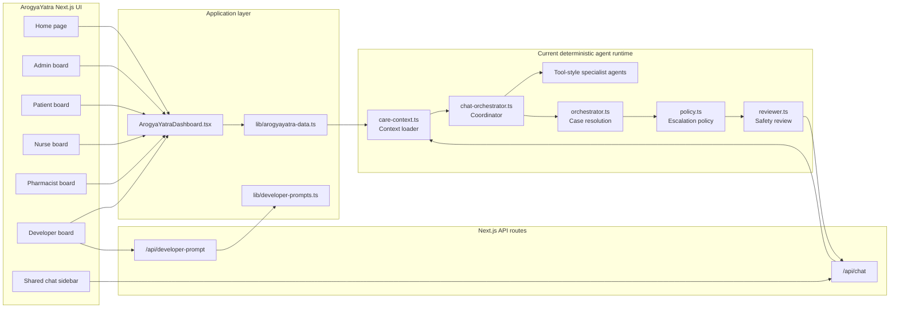
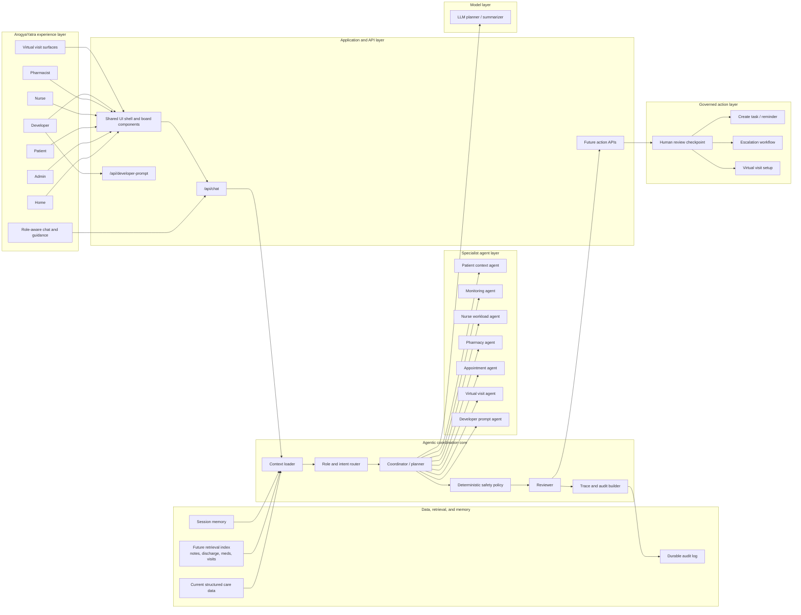

# ArogyaYatra Architecture Redraw

This file redraws both the **existing architecture** and the **target architecture** for ArogyaYatra in a format that can be copied into **Canva** or rebuilt as frames in **Figma**.

The diagrams reflect the current Next.js app and the intended target state for a safer, more complete agentic healthcare coordination platform.

## 1. Existing Architecture

### What exists today

- Multi-role UI boards for `Home`, `Admin`, `Patient`, `Nurse`, `Pharmacist`, and `Developer`
- Shared dashboard shell and page-specific UI components
- Shared MVP care data layer
- `/api/chat` route
- Agentic chat orchestrator with deterministic tool selection
- Care context loader
- Specialist agent/tool functions
- Deterministic policy engine and reviewer layer
- Structured response back to the UI

### Existing architecture diagram



### Existing architecture reading

The current app is **UI-first with deterministic agentic support**. The runtime already behaves like a coordinator, but it is still local and rule-driven. Safety, escalation, and role-specific behavior are explicit. This is the right baseline for healthcare coordination because it avoids unreviewed autonomous behavior.

## 2. Target Architecture

### What the target should add

- Unified role-aware orchestration layer for all boards
- Retrieval over patient history, discharge notes, medication records, appointments, and prior interactions
- Session memory for page and conversation continuity
- Real LLM-backed planner/coordinator behind the same safe contract
- Deterministic policy enforcement before any response or action
- Action tools with human approval for higher-risk operations
- Durable audit logging and feedback loop into the Developer board

### Target architecture diagram



### Target architecture reading

The target state keeps the current healthcare-safe baseline and adds:

- a real planner/coordinator
- retrieval and memory
- governed action tools
- a stronger developer feedback loop
- durable traceability

The important design principle is that the **LLM becomes an orchestrated planning component, not the final authority**. The final authority stays with deterministic policy, reviewer logic, and human oversight where needed.

## 3. Design Direction For Canva Or Figma

Use a **two-frame architecture presentation** with the same visual language as ArogyaYatra.

### Visual style

- Background: soft white with pale aqua gradients
- Primary navy: `#123C74`
- Teal: `#1A9AA6`
- Light aqua: `#DDF4F7`
- Safety gold accent: `#F2C15C`
- Border: `#CFE3E7`
- Card radius: `20px`
- Shadow: very soft, healthcare calm, low contrast

### Typography

- Heading: bold, dark navy, large and clean
- Subheading: medium weight, teal or muted navy
- Body: neutral slate blue-gray

### Layout recommendation

#### Frame 1: Existing Architecture

- Title at top:
  - `ArogyaYatra Existing Architecture`
- Left-to-right structure:
  - UI boards
  - API layer
  - deterministic runtime
  - policy/reviewer
- Add a short footer note:
  - `Current state is deterministic, role-aware, and safe by design.`

#### Frame 2: Target Architecture

- Title at top:
  - `ArogyaYatra Target Architecture`
- Use layered zones:
  - experience layer
  - application/API layer
  - orchestration core
  - specialist agents
  - retrieval and memory
  - governed actions
  - model layer
- Add a short footer note:
  - `Target state adds retrieval, memory, governed actions, and LLM planning under policy control.`

## 4. Canva Build Prompt

Use this prompt in Canva if you want Canva to generate the slide layout:

```text
Create a two-slide architecture presentation for ArogyaYatra, an AI-enabled post-discharge virtual care platform. Use a calm healthcare visual style with soft white backgrounds, light aqua gradients, navy and teal accents, rounded cards, subtle connector arrows, and clean enterprise-healthcare typography.

Slide 1 title: ArogyaYatra Existing Architecture
Show the current system as a deterministic role-based Next.js app with Home, Admin, Patient, Nurse, Pharmacist, and Developer boards leading into shared UI components, /api/chat, a care context loader, chat orchestrator, specialist tool-style agents, deterministic policy engine, reviewer, and structured response back to the UI.
Add a footer note: Current state is deterministic, role-aware, and safe by design.

Slide 2 title: ArogyaYatra Target Architecture
Show the future system as a layered agentic healthcare platform with experience layer, API layer, orchestration core, specialist agents, retrieval and memory, governed action layer, and LLM planner. Make it clear that deterministic policy, reviewer, traceability, and human review govern all sensitive outputs and actions.
Add a footer note: Target state adds retrieval, memory, governed actions, and LLM planning under policy control.
```

## 5. Figma Frame Build Notes

If rebuilding in Figma, create:

1. A `1600 x 900` frame for `Existing Architecture`
2. A `1600 x 900` frame for `Target Architecture`

Recommended component primitives:

- `Arch/LayerCard`
- `Arch/NodeCard`
- `Arch/Arrow`
- `Arch/SectionHeader`
- `Arch/FooterNote`

Recommended node colors:

- Experience/UI nodes: pale aqua
- API/app nodes: white with teal border
- Runtime/orchestration nodes: navy outline with light fill
- Policy/reviewer nodes: soft gold highlight
- Retrieval/memory nodes: pale blue-gray
- Actions/human review nodes: soft teal-green

## 6. What To Keep Consistent

- Keep the diagrams patient-centric and coordination-first
- Do not visually imply autonomous clinical decision-making
- Show policy and reviewer as explicit control points
- Keep the Developer board as a feedback-to-feature-design loop, not only a side utility
- Keep virtual consultation as a first-class capability in the target architecture
