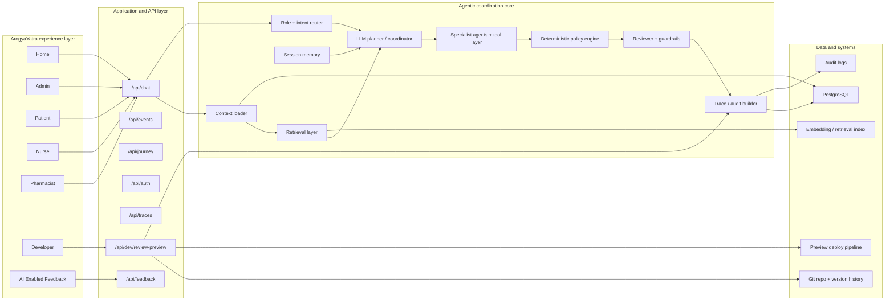
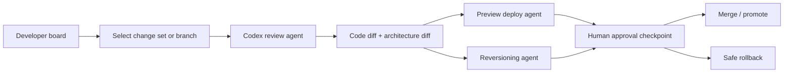

# ArogyaYatra Revised Target Architecture

This document captures the **revised target multi-agent architecture** for ArogyaYatra with three deliverables in one place:

1. A simple block diagram
2. A current-vs-target comparison table
3. A role-by-role agent map

It also adds the new **Developer board capability** for:

- Codex-driven reviews
- safe reversioning
- preview before promotion

## 1. Simple block diagram

## 2. Current vs target comparison

| Area | Current architecture | Revised target architecture |
|---|---|---|
| Frontend | Next.js app with multi-role boards | Same Next.js app, but with real auth, real-time state, persistent data, and richer developer controls |
| Chat/runtime | Deterministic coordinator + tool selection | Safe multi-agent runtime with LLM planner, retrieval, memory, policy, reviewer, and trace persistence |
| Data | Seeded in-memory/shared TypeScript data | PostgreSQL + retrieval index + audit logs + session memory |
| Auth | Mock login UI only | Real authentication, route protection, API protection, role-scoped access |
| Journey state | Fixed data shown in UI | Agent-assisted recommendation + deterministic policy validation + persisted journey transitions |
| Patient support | Static + deterministic guidance | Retrieved history, summarized care context, role-aware assistant, safe escalation |
| Nurse support | Queue and vitals mock logic | Assignment-aware triage, workload balancing, action queue, review trace |
| Pharmacist support | Static refill/task logic | Medication review workflow, interaction checks, refill blockers, nurse/provider coordination |
| Admin support | Prioritization UI from demo data | Persistent operational dashboard, trace-aware priority routing, alerts, staffing load |
| Developer support | Observability-style mock board | Codex-driven review, safe reversioning, preview deploys, trace inspection, prompt/tool inspector |
| Feedback system | Structured prompt generation | Feedback ingestion + backlog classification + feature-design prompts + developer workflow integration |
| Real-time | Not persistent | SSE/WebSocket events for traces, alerts, and operational refresh |
| Deployment | Next.js app on Vercel | Production-ready app with preview workflow, deployment traceability, env management, and domain strategy |

## 3. Role-by-role agent map

### Shared runtime agents

- **Context loader**
  - Loads normalized role, patient, care-team, and page context
- **Role and intent router**
  - Decides what kind of request is being made
- **Planner / coordinator**
  - Chooses which agents and tools to call
- **Policy engine**
  - Enforces deterministic safety rules
- **Reviewer**
  - Blocks incomplete or unsafe outputs
- **Trace builder**
  - Records the chain of reasoning, tools, and outputs

### Patient-facing agents

- **Patient context agent**
  - Summarizes discharge plan, diagnosis, assigned team, current stage
- **Monitoring agent**
  - Interprets symptoms and vitals into safe risk flags
- **Appointment / logistics agent**
  - Explains next appointments, transport, and readiness
- **Virtual visit agent**
  - Handles pre-call readiness, camera, audio, and visit prep
- **Response summarizer**
  - Produces calm patient-safe language

### Nurse-facing agents

- **Nurse workload agent**
  - Daily load, queue pressure, patient assignments
- **Monitoring agent**
  - Highlights who needs attention first
- **Care task agent**
  - Generates action queue for follow-up work
- **Escalation advisor**
  - Recommends escalation pathways, never finalizes autonomously

### Pharmacist-facing agents

- **Pharmacy agent**
  - Refill blockers, fill status, pickup issues, insurance constraints
- **Medication review agent**
  - Medication reconciliation, interaction candidates, continuity issues
- **Care handoff agent**
  - Communicates required coordination with nurse/admin/provider

### Admin-facing agents

- **Priority coordination agent**
  - Ranks top patients, nurses, and pharmacists by urgency
- **Operational load agent**
  - Highlights staffing pressure, queue bottlenecks, refill backlog
- **Journey oversight agent**
  - Monitors stage distribution and workflow throughput

### Developer-facing agents

- **Trace inspector agent**
  - Interprets request/agent/tool history for debugging
- **Prompt and tool inspector agent**
  - Explains prompt inputs, tool invocations, and policy outcomes
- **Codex review agent**
  - Reviews proposed code changes and architecture changes
- **Reversioning agent**
  - Proposes safe revert options or rollback candidates
- **Preview deploy agent**
  - Triggers preview environment and links review to preview URL
- **Governance agent**
  - Makes sure developer operations pass approval and audit checkpoints

### Feedback-facing agents

- **Feedback intake agent**
  - Converts page-level comments into structured product feedback
- **Feature design agent**
  - Generates implementation-ready improvement prompts
- **Backlog routing agent**
  - Maps feedback into UI, runtime, data, or policy workstreams

## Developer board extension: Codex-driven reviews and reversioning

The revised target architecture adds a new **Developer workflow**:

### What the Developer board should support

- review current branch changes
- compare two versions of a feature or file
- generate Codex-driven review comments
- propose safe reversioning options
- preview the app before promotion
- inspect which agent/tool/policy path was changed
- require confirmation before destructive rollback

### Developer board flow

### Safe rules for this developer feature

- no automatic rollback without explicit approval
- no automatic merge to production without approval
- preview first, then approve
- record all review findings and revert actions in audit trace
- keep Git as the source of truth for version history

## How many LLMs are used in the revised target architecture

### Recommended answer

Use **3 logical LLM roles** in the revised target architecture, plus **1 embedding model**.

#### 1. Planner / coordinator LLM
- Purpose:
  - role-aware orchestration
  - tool selection
  - multi-agent planning
  - developer-board review planning

#### 2. Response / summarization LLM
- Purpose:
  - patient-safe explanations
  - nurse/pharmacist/admin summaries
  - feedback-to-feature prompt generation
  - trace summarization for developer inspection

#### 3. Codex / engineering-review LLM
- Purpose:
  - code review
  - architecture review
  - reversioning suggestions
  - preview-readiness checks

#### Plus 1 embedding model
- Purpose:
  - retrieval over patient history
  - discharge notes
  - medication records
  - feedback archive
  - traces and developer search

### Practical deployment note

You can implement this in two ways:

#### Minimal physical model footprint
- **2 actual LLM endpoints**
  - one strong tool-calling model for planner + response tasks
  - one coding-optimized model for developer review/reversioning
- **1 embedding model**

#### Clearer enterprise separation
- **3 actual LLM endpoints**
  - planner/orchestrator model
  - clinician-safe summarization model
  - coding/review model
- **1 embedding model**

### Recommended starting point

For ArogyaYatra, the best practical starting architecture is:

- **2 actual LLM services**
- **1 embedding model**
- deterministic policy engine
- reviewer layer
- optional later multimodal model for document/camera workflows

That gives cost control while keeping a clean logical separation.

## Final recommendation

The revised target architecture should be described like this:

> ArogyaYatra is a healthcare-safe, agent-assisted coordination platform where a planner routes role-aware requests across specialist agents, retrieval, policy, and reviewer layers; journey-state updates are recommendation-driven but deterministically validated; and the Developer board adds Codex-driven review, preview, and safe reversioning on top of a traceable multi-agent runtime.
